```{r setup, include=FALSE}
options(htmltools.dir.version = FALSE)
knitr::opts_chunk$set(
  fig.width=9, fig.height=3.5, fig.retina=3,
  out.width = "100%",
  cache = FALSE,
  echo = TRUE,
  message = FALSE, 
  warning = FALSE,
  fig.show = TRUE,
  hiline = TRUE,
  eval = FALSE
)
```

```{r libraries, eval = T, include=FALSE, warning=FALSE}
if(! require(pacman)) install.packages("pacman")

pacman::p_load(
  tidyverse,
  here,
  xaringan,
  xaringanExtra,
  xaringanthemer,
  emo,
  janitor,
  tidycensus
)
```

```{r xaringanExtra-search, eval=T, echo=FALSE}
xaringanExtra::use_search(show_icon = TRUE)
```

```{r xaringanExtra-clipboard, eval=T, echo=FALSE}
htmltools::tagList(
  xaringanExtra::use_clipboard(
    button_text = "<i class=\"fa fa-clipboard\"></i>",
    success_text = "<i class=\"fa fa-check\" style=\"color: #90BE6D\"></i>",
  ),
  rmarkdown::html_dependency_font_awesome()
)
```

```{r xaringan-tile-view, eval=T, echo=FALSE}
xaringanExtra::use_tile_view()
```

```{r xaringanExtra-freezeframe, echo=FALSE}
xaringanExtra::use_freezeframe()
```


```{r xaringan-themer, eval = T, include=FALSE, warning=FALSE}
udel_blue <- "#006096"
style_duo_accent(
  primary_color = udel_blue,
  secondary_color = udel_blue,
  inverse_header_color = "#FFFFFF"
)
```

class: animated, fadeIn, content-slide
layout: true

---

class: title-slide, middle
layout: false

# Foundations of R for Data Analysis

### Week 05: Joining & Reshaping Datasets

Ryan Harrington<br>
October 25, 2021<br>
University of Delaware<br>
College of Professional & Continuing Studies

---

class: content-slide

# Questions We'll Answer Today

### `r emo::ji("notebook")` How can I create my own repositories?<br>
### `r emo::ji("plug")` What is an API and how can I use one?<br>
### `r emo::ji("us")` How can we use US Census data in our work?<br>
### `r emo::ji("arrows_counterclockwise")` How can I reshape my data?<br>
### `r emo::ji("handshake")` How can I join multiple datasets together?<br>
### `r emo::ji("earth_asia")` How can I publish my work online?<br>

---

class: content-slide

# Review of Week 3 Assignment

---

class: content-slide

# Initializing a repository

So far you have primarily worked with cloned repositories. You have successfully followed the pattern of using `git clone` to create a copy of the remote repository that you are working with on your local machine.

Today we're going to go through the process of setting up your own repository.

Let's start on your machine by setting up everything that you'll need. In order, you will:

1. Select the location for your new repository. This should be somewhere logical for the work that you'll be doing!
2. Create a new R project. You should set the project to be where your new repository was created.
3. Create a `README.md` file. This should include a brief description of the work that you're about to complete.
4. Create a `.gitignore` file. This should include any files that you DON'T want on GitHub.

---

class: content-slide

# Initializing a repository

In my case, I'm going to create a new folder inside of the `Example` folder that I've set-up for class. You might choose to put yours somewhere else. I'm going to call this folder `Census_Exploration`.

.rounded-corners.center[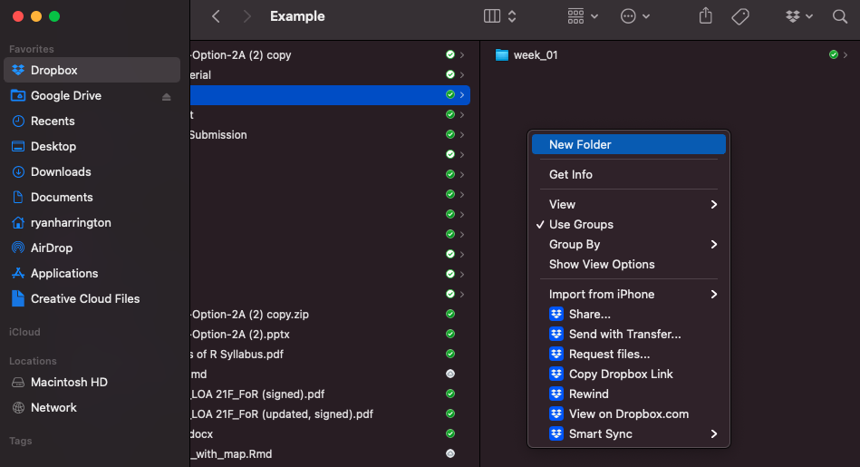]

---

class: content-slide

# Initializing a repository

You can create a new project by going to `File` > `New Project`. We'll want to work with an `Existing Directory`, so select that. You can navigate to the folder that you've created and select it. I recommend selecting `Open in new session` as well.

.pull-left[
.rounded-corners.center[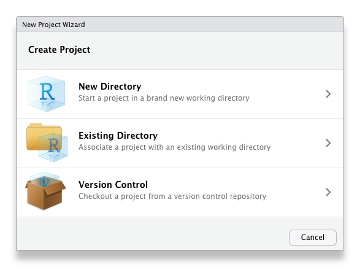]
]

.pull-right[
.rounded-corners.center[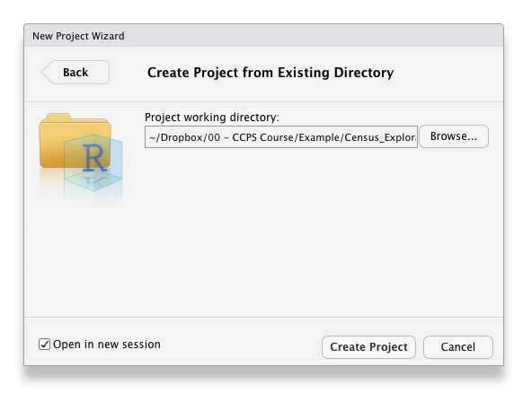]
]

---

class: content-slide

# Initializing a repository

A new instance of R will be created and set to where you want to work from.

.rounded-corners.center[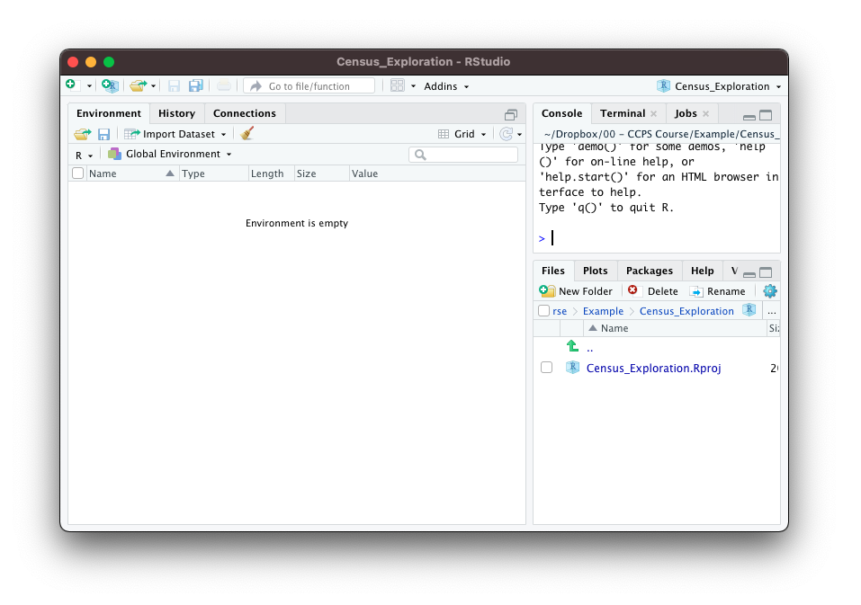]

---

class: content-slide

# Initializing a repository

Next, create a `README.md` file. You can do this by navigating to `File` > `Text File`. In the bottom right corner of your source screen, you can change this to a `Markdown` file.

.pull-left[
.rounded-corners.center[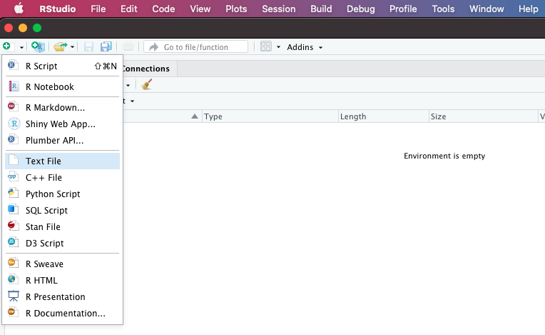]
]

.pull-right[
.rounded-corners.center[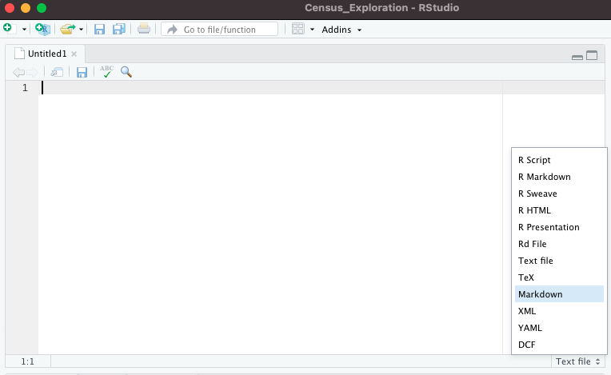]
]

---

class: content-slide

# Initializing a repository

Save your file as `README.md`. This will allow it to be rendered appropriately once on GitHub.

.rounded-corners.center[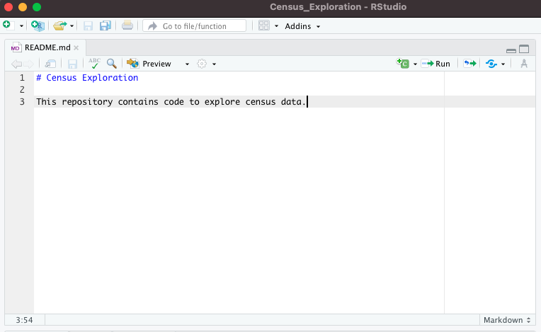]

---

class: content-slide

# Initializing a repository

Now, you'll want to create your `.gitignore` file. I tend to use a template from [gitignore.io](https://www.toptal.com/developers/gitignore/api/r). This will exclude all of the files that you *don't* want to make it to GitHub.

Repeat a similar process to making the `README.md` file. Go to `File` > `Text File`. This time, we'll leave it as a `text file` in the drop down, though.

Copy the template from gitignore.io here. Save your file as `.gitignore`. You may get a notice warning you about creating a file that starts with a `.`. This is okay - continue onwards.

---

class: content-slide

# Initializing a repository

.pull-left[
.rounded-corners.center[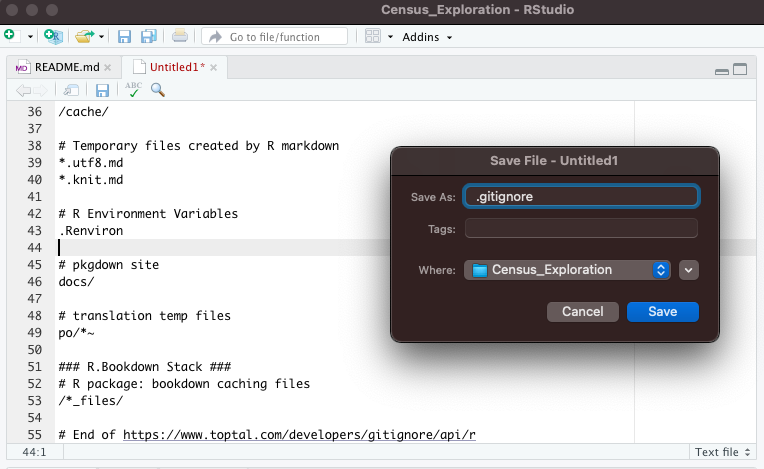]
]

.pull-right[
.rounded-corners.center[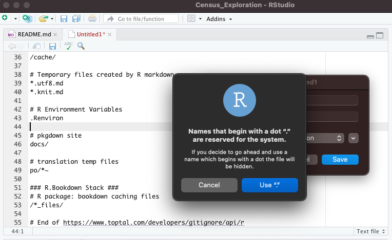]
]

---

class: content-slide

# Initializing a repository

Now we can go set up the repository on GitHub. Select `New` on the Repositories left sidebar.

.rounded-corners.center[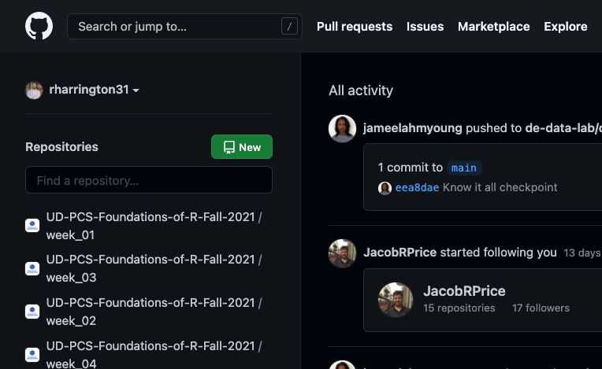]

---

class: content-slide

# Initializing a repository

.pull-left[
Give your repository a name. Possibly a description. Leave it public. Don't select anything else! Select `Create repository` once you've finished this.
]

.pull-right[
.rounded-corners.center[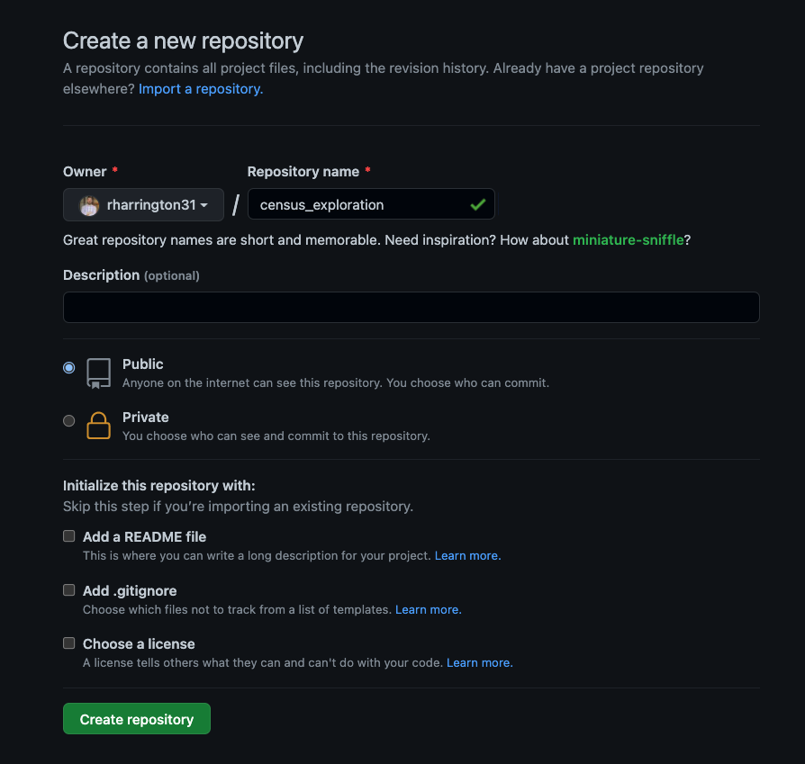]
]

---

class: content-slide

# Initializing a repository

Congrats! Your repository has been created on GitHub. It's currently empty and so it conveniently gives you instructions for how to go about connecting it to the local repository that we've already created.

.rounded-corners.center[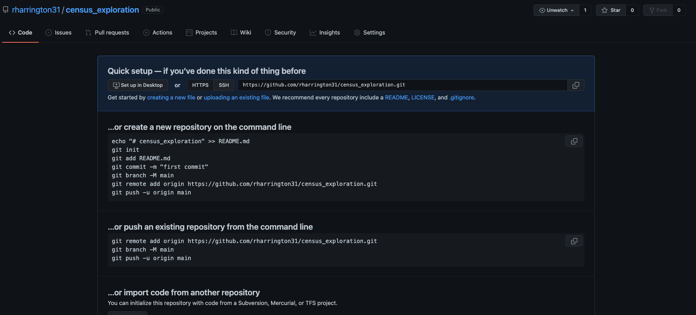]

---

class: content-slide

# Initializing a repository

Finally, we have to connect our remote repo on GitHub to our local repo on our machine. You can use the Terminal (Mac) or Git Bash (PC) to navigate to the directory that we created earlier. Once there, you need to run a few quick commands:

You'll initialize git in the repository as follows:

```{bash}
git init
```

And then connect to the remote:

```{bash}
git add remote origin <your link here>
```

And finally, you can use the same pattern that we've used for adding code previously:

```{bash}
git add .
git commit -m "Initial commit"
git push origin master
```

---

class: content-slide

# APIs

So far, we have primarily utilized CSV files to work with data in R. Another popular way to work with data is to extract it from an API or "Application Programming Interface".

An API is just a way for two pieces of software to talk to each other in a secure way. You've used APIs nearly every time you've interacted with some of your favorite websites.

For example, consider websites like Kayak or Expedia. How do they get all of the information about flights into one place?

Each airline exposes an API designed for others to extract the appropriate data. Kayak and Expedia then ingest this data, normalize it, and expose it to the end user - you!

APIs can be a great source of data for personal or work projects.

---

class: content-slide

# How do you interact with APIs?

APIs come in a variety of shapes and sizes. They can be public, private, paid, or free.

For example, Twitter provides an [API](https://developer.twitter.com/en/docs/twitter-api) that allows you to programmatically interact with it. You can extract tweets, information about profiles, or even post tweets. This is how many Twitter bots work.

By default, you can extract *some* historical tweets, but you cannot get the history of all tweets ever. In order to do that, Twitter requires you to pay.

Other APIs will perform tasks for you. As an example, pretend that you have a list of addresses. You want to be able to plot those addresses on a map, which means that you need to conver them to latitude and longitude coordinates. You might use the [Google Maps API](https://developers.google.com/maps/documentation/geocoding/overview) to do this for you. You can do this for free up to a certain number per day, but you can always pay for more.

---

class: content-slide

# How do you interact with APIs?

At its core, APIs function by sending requests to the server that the API is hosted on. The requests ultimately look just like URLs and you can manipulate them accordingly. You'll often hear APIs referred to as being RESTful. This refers to a common API architectural style known as "**RE**presentational **S**tate **T**ransfer".

Each URL that is created is called a "request" and the information sent back to you is called a "response". Each request is composed of 4 pieces of information:

1. The endpoint
2. The method
3. The headers
4. The data / body

You can learn more about REST APIs and how they work here. You can also interact with APIs in R via the [`httr` package](https://cran.r-project.org/web/packages/httr/vignettes/quickstart.html).

It is very common in R for developers to create packages that simplify working with specific APIs. We'll be using one of those today.

---

class: content-slide

# Census Data

.pull-left[
One API source to consider for projects is Census data.

Traditionally, you might interact with Census data by downloading the file that you need from the Census website. This is great and would work, but it can be inconsistent and lead to challenges in sharing your work.

Conveniently, the Census has developed an [API](https://www.census.gov/data/developers/data-sets.html) to allow you to interact with their data.

Even more conveniently, there is a R package that allows you to directly interact with the Census API in a relatively easy way: [`tidycensus`](https://walker-data.com/tidycensus/).

```{r}
install.packages("tidycensus")
library(tidycensus)
```
]

.pull-right[
.center[]
]

---

class: content-slide

# Census Data - Decennial vs. ACS

If you're unfamiliar with the US Census, there are a couple of key datasets to understand - the Decennial Census and the American Community Survey. Here's how those are different ([source](https://www.census.gov/programs-surveys/acs/about/acs-and-census.html)):

|Decennial Census   |American Community Survey      |
|-------------------|-------------------------------|
| Conducted every ten years | Conducted every month, ever year |
| Counts every person living in the 50 states, District of Columbia, and the five U.S. territories | Sent to a sample of addresses (about 3.5 million) in the 50 states, District of Columbia, and Puerto Rico |
| Asked a shorter set of questions, such as age, sex, race, Hispanic origin, and owner/renter status | Asks about topics not on the 2020 Census, such as education, employment, internet access, and transportation
| Provides current information to communities every year.  It also provides local and national leaders with the information they need for programs, economic development, emergency management, and understanding local issues and conditions. | Provides an official count of the population, which determines congressional representation.  Also provides critical data that lawmakers and many others use to provide daily services, products, and support for communities. |

---

class: content-slide

# Census Data

The `tidycensus` package allows you to work with either of these datasets (and a few others). For today, we'll work with ACS data. To do that with `tidycensus`, we'll use the `get_acs` function. 

There are several parameters that you can use, but the three that you'll always need are `geography`, `variables`, and `year`. Here's an example:

```{r}
get_acs(geography = "county", 
        variables = "B19013_001", 
        year = 2018)
```

You'll notice that the variables don't have particularly helpful names. Normally, we'd utilize a code book to figure out what each variable is named. Alternatively, you can use the `load_variables` function to do this. Simply designate the year and dataset that you'd like to work with, for example, `2018` and `"acs5"`:


```{r}
load_variables(2018, "acs5")
```

---

class: content-slide

# Gender Breakdown by State

Suppose that we want to understand the gender breakdown by state. Here's how we might do this.

First, create a list of the variables you want to access:

```{r, eval=T}
gender_vars <- c(
  total = "B01001_001",
  male = "B01001_002",
  female = "B01001_026"
)
```

Next, use `get_acs` to make a request to the Census API. The response will be your data.

```{r, eval=T, cache=T}
gender_by_state <- 
  get_acs(geography = "state",
          variables = gender_vars,
          year = 2018)
```

---

class: content-slide

# "Long" data

Note how the data is returned to us. What you might have expected is that the data would be returned with one column for each of our `variable` fields. Instead, the column is returned such that we have one record for each state for each variable. If we were to describe the "shape" of this dataset, we would describe it as being "long".

Long data is often quite useful for graphing, but less so for other common tasks that we might want to complete, such as data cleaning or model building.

---

class: content-slide

# "Wide" or "tidy" data

On the flip side of this is what we are typically used to, which is a "wide" dataset. `tidycensus` includes options to transform our data into a "wide" dataset.

```{r, eval=T, cache=T}
gender_by_state_wide <- 
  get_acs(geography = "state",
          variables = gender_vars,
          year = 2018,
          output = "wide")
```

This is how you are likely used to working with data. Besides calling this dataset "wide", another common name for it is "tidy". The tidyverse is particularly adept at working with data that takes this shape. 

---

class: content-slide

# Rules of "tidy" data

Tidy data is marked by these three rules:

> 1. Each variable must have its own column.
> 2. Each observation must have its own row.
> 3. Each value must have its own cell.

[Source](https://r4ds.had.co.nz/tidy-data.html)

.center[]

---

class: content-slide

# Reshaping data

.pull-left[
You'll very frequently need to convert back and forth between wide and long data depending upon the particular use case that you're solving for. There are two functions that make this easier for you...and do exactly what they sound like they do:

*  `pivot_wider` - "widens" data, increasing the number of columns and decreasing the number of rows
*  `pivot_longer` - "lengthens" data, increasing the number of rows and decreasing the number of columns

Let's look back at our example of `gender_by_state`. Suppose we want to better understand which state's have the highest percentage of women.
]

.pull-right[

.center[
[Source](https://github.com/gadenbuie/tidyexplain)
]

]

---

class: content-slide

# Which states are the highest percent women?

We'll start by working with our long dataset to demonstrate how to `pivot_wider`.

The key is to identify the field that you want to extract your `names_from` and the field that you want to extract your `values_from`. In our case, those fields are `variable` and `estimate` respectively.

```{r}
gender_by_state %>% 
  select(-moe) %>% 
  pivot_wider(names_from = variable, #<<
              values_from = estimate) %>% #<<
  mutate(across(c(male, female), ~ . / total, .names = "{.col}_percent")) %>% 
  ggplot(aes(x = female_percent,
             y = NAME)) +
  geom_col() +
  theme_minimal() +
  scale_x_continuous(labels = scales::percent)
```

---

class: content-slide

# Which states are the highest percent women?

Small tip - using `fct_reorder` is a nice way to improve your graphs.

```{r}
gender_by_state %>% 
  select(-moe) %>% 
  pivot_wider(names_from = variable,
              values_from = estimate) %>%
  mutate(across(c(male, female), ~ . / total, .names = "{.col}_percent"),
         NAME = fct_reorder(NAME, female_percent)) %>% #<<
  ggplot(aes(x = female_percent,
             y = NAME)) +
  geom_col() +
  theme_minimal() +
  scale_x_continuous(labels = scales::percent)
```

---

class: content-slide

# How does population age change by state?

If we want to understand population trends, one way to do that is to explore how our population ages change by state.

We'll use some of the fields from the `PLACE OF BIRTH BY AGE IN THE UNITED STATES` concept to do that.

```{r, eval=T}
age_vars <- c(
  "total"             = "B06001_001",
  "Under 5 years"     = "B06001_002",
  "5 to 17 years"     = "B06001_003",
  "18 to 24 years"    = "B06001_004",
  "25 to 34 years"    = "B06001_005",
  "35 to 44 years"    = "B06001_006",
  "45 to 54 years"    = "B06001_007",
  "55 to 59 years"    = "B06001_008",
  "60 to 61 years"    = "B06001_009",
  "62 to 64 years"    = "B06001_010",
  "65 to 74 years"    = "B06001_011",
  "75 years and over" = "B06001_012"
)
```

---

class: content-slide

# How does population age change by state?

First, use `get_acs` to ingest your variables.

```{r, eval=T, cache=T}
age_by_state <- 
  get_acs(geography = "state",
          variables = age_vars,
          year = 2018)
```

Then pivot your data appropriately.

You'll want to get your `names_from` `variable` and your `values_from` `estimate`.

```{r, eval=T}
age_by_state_wide <- 
  age_by_state %>%
  select(-moe) %>% 
  pivot_wider(names_from = variable, #<<
              values_from = estimate) #<<
```

---

class: content-slide

# How does population age change by state?

First, use `get_acs` to ingest your variables.

```{r}
age_by_state <- 
  get_acs(geography = "state",
          variables = age_vars,
          year = 2018)
```

Then pivot your data appropriately.

Just to demonstrate, you can `pivot_wider` with `values_from` multiple columns - for example, both `estimate` and `moe`.

```{r}
age_by_state %>%
  pivot_wider(names_from = variable,
              values_from = c(estimate, moe)) #<<
```

---

class: content-slide

# How does population age change by state?

```{r}
age_by_state <- 
  get_acs(geography = "state",
          variables = age_vars,
          year = 2018)
```

Then pivot your data appropriately.

In this case, `moe` is sometimes `NA`. We can use the convenient `values_fill` parameter to set this to `0`.

```{r}
age_by_state %>%
  pivot_wider(names_from = variable,
              values_from = c(estimate, moe),
              values_fill = 0) #<<
```

---

class: content-slide

# How does population age change by state?

Let's keep things simple, though and only work with `estimate`.

We can go ahead and use a similar strategy to what we did with gender in order to normalize the data.

```{r}
age_by_state_wide %>% 
  mutate(across(c(-GEOID, -NAME, -total), ~ . / total))
```
This is great, but how do we go about graphing this? Long data would actually be much better in this case.

---

class: content-slide

# How does population age change by state?

Let's rethink how to approach this.

We need to reshape our data so that it is slightly less long than what we had before. We'll want all of our age groups as one column and the population total as another column.

`pivot_longer` will make that easier for us. You'll need to specify the names of the columns that you want to pivot. 

```{r}
age_by_state_wide %>% 
  pivot_longer(cols = c(-GEOID, -NAME, -total)) #<<
```
There are some handy arguments to give your newly created columns some better names:

```{r, eval=T}
age_by_state_brackets <- 
  age_by_state_wide %>% 
  pivot_longer(cols = c(-GEOID, -NAME, -total),
               names_to = "age_bracket", #<<
               values_to = "estimate") %>% #<<
  select(GEOID, NAME, age_bracket, estimate, total)
```

---

class: content-slide

# How does population age change by state?

First, normalize your data.

```{r}
age_by_state_brackets %>% 
  mutate(estimate_norm = estimate / total)
```

---

class: content-slide

# How does population age change by state?

Then graph. Note that we're adjusting factor levels again here.

```{r}
age_factors <- c(
  "total", "Under 5 years", "5 to 17 years", "18 to 24 years", "25 to 34 years", "35 to 44 years", "45 to 54 years", "55 to 59 years", "60 to 61 years", "62 to 64 years", "65 to 74 years", "75 years and over"
)

age_by_state_brackets %>% 
  mutate(estimate_norm = estimate / total,
         age_bracket = fct_relevel(age_bracket, age_factors)) %>% 
  filter(! NAME %in% c("District of Columbia", "Puerto Rico")) %>% 
  ggplot(aes(x = estimate_norm,
             y = age_bracket)) +
  geom_col() +
  scale_x_continuous(labels = scales::percent) +
  facet_wrap(~ NAME, ncol = 10) +
  theme_minimal()
```

---

class: content-slide

# Exploring Counties

The Census API allows you to explore many different levels of geographies - all the way down to a census block. Counties are a common way to explore data. Let's see how total population changes across all counties in the United States.

```{r, eval=T}
county_pop <- 
  get_acs(geography = "county",
          variables = c(total = "B01001_001"),
          year = 2018)
```
It is easy enough for us to quickly understand which county has the highest population.

```{r}
county_pop %>% 
  arrange(desc(estimate))
```

---

class: content-slide

# Exploring Counties

What if we want to understand which county makes up the highest percent of a state's population, though?

In order to do that, we'll need to also get each state's population. Let's do that.

```{r, eval=T}
state_pop <- 
  get_acs(geography = "state",
          variables = c(total = "B01001_001"),
          year = 2018)
```

If we want to normalize our data, then we need to somehow combine our state dataset with our county dataset. In order to do this, we need to be able to **join** our data together.

---

class: content-slide

# Joins

It is very common practice to need to utilize multiple datasets in the course of your work. In order to do this, we need to understand how the datasets that we are working with relate to each other. This is the strength of joins.

If you have worked with SQL before, then you have almost definitely run into joins at some point.

If you are primarily an Excel user, then you have probably used some combination of `VLOOKUP` or `INDEX MATCH` to accomplish similar tasks. These are overcomplicated and underpowered versions of what a join can accomplish.

---

class: content-slide

# Joins

Most important to unlocking the power of joins is understanding the concept of **keys**.

Any variable that connects a pair of tables together is referred to as a key. This can often be something like an ID number, but it does not have to be. Most important is that a key can uniquely identify an observation in your table. A key can consist of one or multiple variables.

There are two types of keys:

* **Primary keys** - uniquely identify an observation in its own table
* **Foreign keys** - uniquely identifies an observation in another table

---

class: content-slide

# Joins

.pull-left[
Joins come in three broad flavors ([source](https://r4ds.had.co.nz/relational-data.html)):

> * **Mutating joins**, which add new variables to one data frame from matching observations in another.
> * **Filtering joins**, which filter observations from one data frame based on whether or not they match an observation in the other table.
> * **Set operations**, which treat observations as if they were set elements.

For the purposes of our course, we'll primarily be using mutating joins.

The outcomes of joins are often represented as Venn Diagrams.
]

.pull-right[

]


---

class: content-slide

# Left Joins

.pull-left[
All rows from `x`, and all columns from `x` and `y`. Rows in `x` with no match in `y` will have `NA` values in the new columns.
]

.pull-right[

]

---

class: content-slide

# Left Joins

.pull-left[
… If there are multiple matches between `x` and `y`, all combinations of the matches are returned.
]

.pull-right[

]

---

class: content-slide

# Right Joins

.pull-left[
All rows from `y`, and all columns from `x` and `y`. Rows in `y` with no match in `x` will have `NA` values in the new columns.
]

.pull-right[

]

---

class: content-slide

# Inner Joins

.pull-left[
All rows from `x` where there are matching values in `y`, and all columns from `x` and `y`.
]

.pull-right[

]

---

class: content-slide

# Full Joins

.pull-left[
All rows and all columns from both `x` and `y`. Where there are not matching values, returns `NA` for the one missing.
]

.pull-right[

]

---

class: content-slide

# Joining county data

In order to join our `county_pop` and `state_pop` dataframes together, we need to do a bit of prep work.

First, let's identify the key between these two tables. There doesn't appear to be a clear key that exists in both datasets. However, each table does have one field that is an unique identifier - `GEOID`.

Let's take a look at that field more closely. 

Note that the `GEOID` field in the `state_pop` table is always two digits: `01` for Alabama, `02` for Alaska, etc.

Now look at the `GEOID` field in the `county_pop` dataset. Note that it is always five digits. If you explore the `GEOID` values for counties in Alabama, they always begin with `01`. If you explore the `GEOID` values for counties in Alaska, they always begin with `02`. This is true for all of the `GEOID` values. We can use this as a key with a little bit of work.

---

class: content-slide

# Joining county data

Let's extract the first two digits from the `GEOID` field in the `county_pop` table and create a new variable.

```{r, eval=T}
county_pop_clean <- 
  county_pop %>% 
  mutate(GEOID_state = substr(GEOID, 1, 2))
```

We want each record in our `county_pop_clean` dataset to include information about the state population from the `state_pop` dataset. This means we want to keep all records from `county_pop_clean` and match them with records from `state_pop`. We can use a `left_join` to accomplish this.

---

class: content-slide

# Joining county data

Regardless of the type of join that we utilize, they all follow a similar pattern in terms of the arguments that they accept. We'll use `left_join` as an example, though

```{r}
left_join(x, y, by)
```

Applying that to our scenario, that might look like this:

```{r}
left_join(
  x = county_pop_clean, # Left side of the join
  y = state_pop,        # Right side of the join
  by = "GEOID"          # Key(s)
)
```

---

class: content-slide

# Joining county data

You'll notice that this leads to a problem, though. Nothing matched. This is because our key has a different name in each dataset. This is an easy enough fix.

```{r}
left_join(
  x = county_pop_clean,              # Left side of the join
  y = state_pop,                     # Right side of the join
  by = c("GEOID_state" = "GEOID")    # Key(s) #<<
)
```

Notice that after the join our new dataframe has the same number of records as our previous dataset. This is normally a good sign that the join did what we were expecting it to do.

Also notice that many of the column names include a suffix of either `.x` or `.y` depending upon which dataframe they came from. This will only be true for variables that exist in both dataframes. There are a few ways that we can control this behavior.

---

class: content-slide

# Joining county data

One option is to adjust how the suffix naming works as part of the join. You can change the default of `.x` and `.y` to something that is more useful for your purposes (or just stick with the defaults if you choose).

```{r}
left_join(
  x = county_pop_clean,               # Left side of the join
  y = state_pop,                      # Right side of the join
  by = c("GEOID_state" = "GEOID"),    # Key(s)
  suffix = c("_county", "_state")     # Change the suffix #<<
)
```

---

class: content-slide

# Joining county data

Another option would be to deal with the issue ahead of time by renaming columns in the original dataframes. In our case, we might want to remove fields that we aren't using as well.

`rename` is a function that is part of `dplyr` that allows us to do exactly this. It is also possible to rename fields as part of a `select` statement. We'll demonstrate both here. First using `rename` to update the `county_pop_clean` dataframe.

```{r, eval = T}
county_pop_clean <- 
  county_pop_clean %>% 
  rename("county" = NAME, "population" = estimate) %>% #<<
  select(GEOID, GEOID_state, county, population)
```
And then using `select` to update the `state_pop` dataframe.

```{r, eval=T}
state_pop_clean <- 
  state_pop %>% 
  select("GEOID_state" = GEOID, "state" = NAME, "population" = estimate) #<<
```

---

class: content-slide

# Joining county data

We can put this all together now:

```{r}
county_pop_full <- 
  left_join(
    x = county_pop_clean,               # Left side of the join
    y = state_pop_clean,                # Right side of the join
    by = "GEOID_state",                 # Key(s)
    suffix = c("_county", "_state")     # Change the suffix
  )
```

And, finally, we can answer our question:

```{r}
county_pop_full %>% 
  mutate(population_county_norm = population_county / population_state) %>% 
  arrange(desc(population_county_norm))
```

---

class: content-slide

# Joining county data

And now graph it! The `slice` function is a useful way to extract specific rows from a table.

```{r}
county_pop_full %>% 
  mutate(population_county_norm = population_county / population_state) %>% 
  arrange(desc(population_county_norm)) %>% 
  slice(1:10) %>% #<<
  mutate(county = fct_reorder(county, population_county_norm)) %>% 
  ggplot(aes(x = population_county_norm,
             y = county)) +
  geom_col(fill = "#006096") +
  scale_x_continuous(labels = scales::percent) + 
  theme_minimal() +
  labs(x = "",
       y = "",
       title = "US counties that account for the highest percentage of their state's population") +
  theme(plot.title.position = "plot",
        title = element_text(face = "bold"))
```

---

class: content-slide

# Joining by multiple fields

It is not uncommon to have multiple keys that you need to utilize in order to join two datasets together.

We can revisit our exploration of gender by state. Let's now investigate this same data by county. We can make the same adjustment to `GEOID` so that we can facilitate a join later.

```{r, eval=T, cache=T}
gender_by_county <- 
  get_acs(geography = "county",
          variables = gender_vars,
          year = 2018) %>% 
  mutate(GEOID_state = substr(GEOID, 1, 2))
```

We want to understand the percent of each county's male, female, and total population that takes up the greatest percentage of that county's state male, female, and total population.

---

class: content-slide

# Joining by multiple fields

We can specify multiple fields to join with as part of the `by` argument. In our case, we need to join by `GEOID` and the `variable`.

```{r}
gender_by_county %>% 
  left_join(gender_by_state,
            by = c("GEOID_state" = "GEOID", #<<
                   "variable"), #<<
            suffix = c("_county", "_state"))
```

Note that when joining by `GEOID`, we had to specify the name of the field on both the right hand side and the left hand side because they have different field names (`GEOID_state` vs `GEOID`). However, when joining by `variable`, we did not have to make the change because each dataset included a `varabile` field that was named identically *and* was the appropriate field for our needs.

---

class: content-slide

# Joining by multiple fields

We can specify multiple fields to join with as part of the `by` argument. In our case, we need to join by `GEOID` and the `variable`.

```{r}
gender_by_county %>% 
  left_join(gender_by_state,
            by = c("GEOID_state" = "GEOID", #<<
                   "variable"), #<<
            suffix = c("_county", "_state")) %>% 
  mutate(percent = estimate_county / estimate_state) %>% 
  arrange(desc(percent))
```

---

class: content-slide

# Knitting your RMarkdown file

So far we've been using RMarkdown files interactively. However, they are an excellent way to share and document your findings. RMarkdown files can be output to many different types of files:

* HTML
* Presentations
* Word Documents
* PDFs
* LaTeX

Every presentation that has been given in this class was created using Markdown. It's exceptionally useful!

To do that, it is as simple as selecting `Knit`. You can also do this programatically via the `markdown::renderMarkdown` function.

.rounded-corners.center[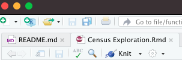]

---

class: content-slide

# GitHub Pages

You can share your knitted RMarkdown files in many ways. I'll often simply email them to clients. However, you can host these online. An easy way to do that, and to start building a portfolio for yourself, is to do that directly via GitHub.

GitHub includes a feature called "GitHub Pages". You can transform each of your repositories into a simple website by simply adjusting a setting.

Navigate to `Settings` > `Pages` and you'll be able to select the branch that you want converted into a GitHub page. It will be rendered as `<your_github_username>.github.io/<your_repository_name>`.

---

class: content-slide

# For next week

Complete your assignment by 5:59 pm submitted via GitHub.

#### Textbook
-   [Chapter 14 - Strings](https://r4ds.had.co.nz/strings.html)
-   [Chapter 15 - Factors](https://r4ds.had.co.nz/factors.html)
-   [Chapter 16 - Dates and times](https://r4ds.had.co.nz/dates-and-times.html)

---

class: title-slide, middle
layout: false

# Foundations of R for Data Analysis

### Week 05: Joining & Reshaping Datasets

Ryan Harrington<br>
October 25, 2021<br>
University of Delaware<br>
College of Professional & Continuing Studies